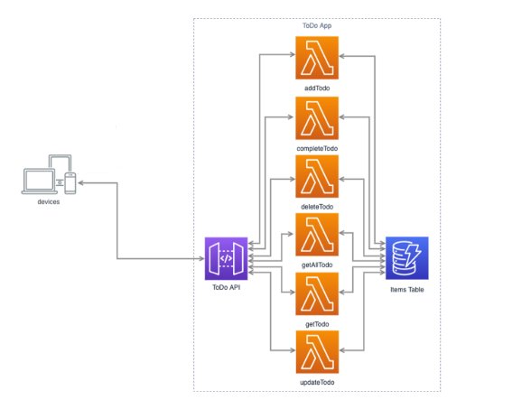

# Serverless ToDo Application

This serves as a basic serverless ToDo application. Operating as a web application backend, it employs AWS Lambda and Amazon API Gateway, functioning in an event-driven manner. Additionally, it utilizes Amazon DynamoDB as its database. For hosting static content, AWS S3 Console is utilized. The diagram below illustrates its overall architecture.

